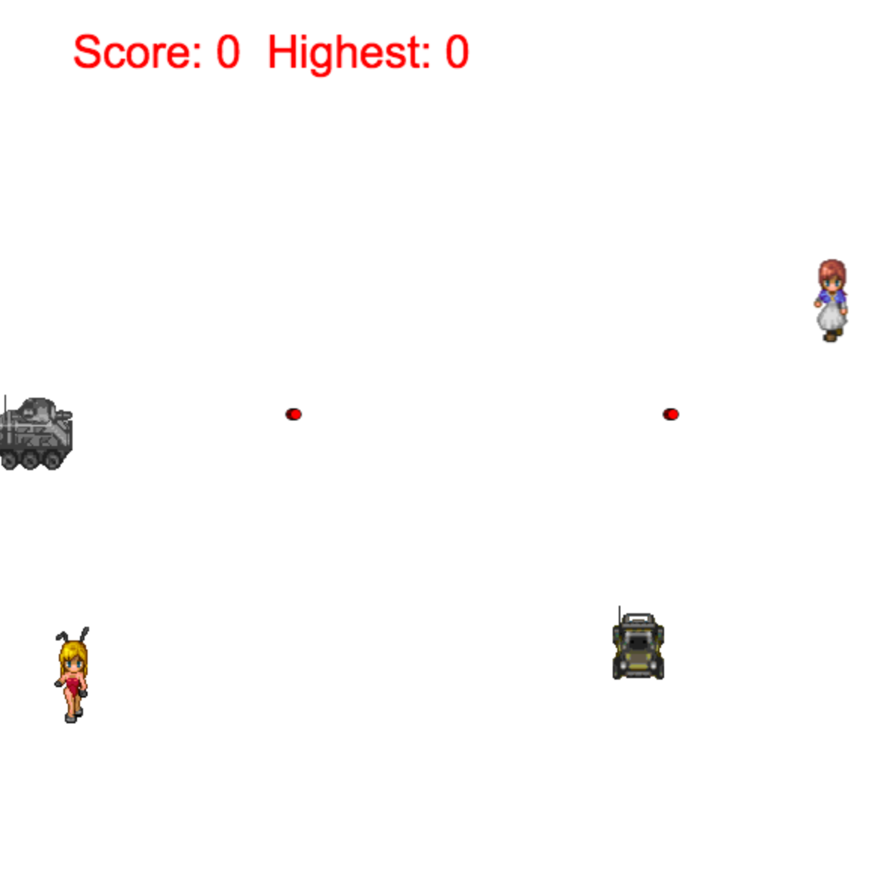
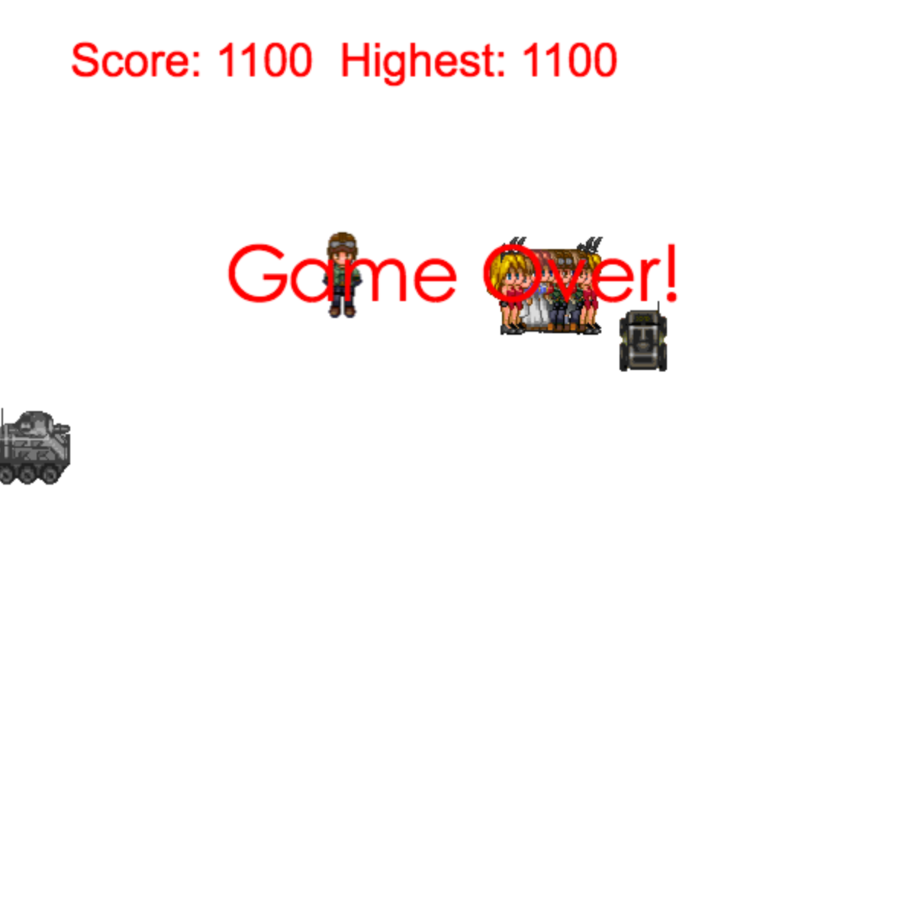

## 用canvas实现的一个模仿贪吃蛇的游戏

###先上图片

###玩法

1. 游戏刚开始时玩家可通过方向键控制人物走动
2. 地图上随机刷新一个新人物，玩家通过靠近新人物将新任务拉入队列并获得分数
3. 队列越长，移动速度越快
4. 左方坦克会不断发射子弹，玩家要从子弹直接穿梭，一旦列领头人物被子弹射中则游戏终结
5. 右侧装甲车会垂直移动，只要队列中有人被撞则游戏结束
6. 玩家撞墙也会终结游戏

###产生过程

本来只想简单的练习一下canvas的图片帧动画，后来为了让人物看起来跑得更快点于是在人物后面添加了一些“幻影”，最后一发不可收拾完成了这个作品

###除了canvas

+ 通过`localStroge`实现了最高分数记录
+ 通过`requestAnimationFram`实现了基于时间的动画

###反省
+ 因为写在兴头上，200多行代码一句注释都没有写，导致后面想加点新的东西都没法加，这一点要好好反省！！！